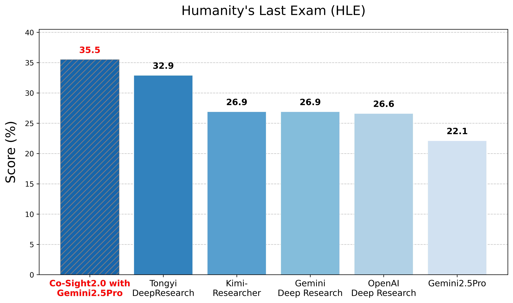
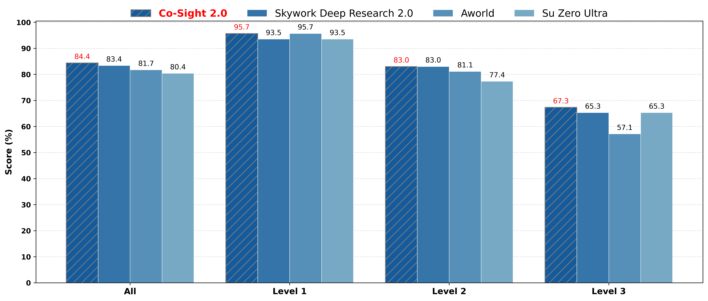
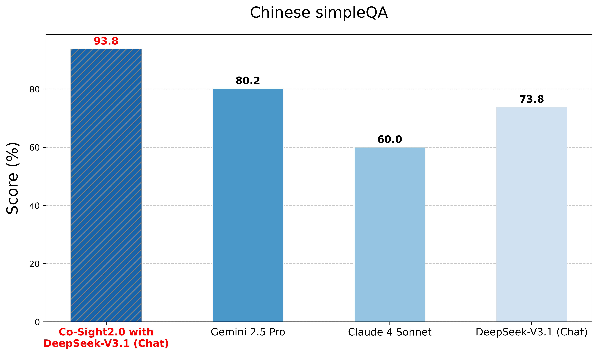

查看[中文版说明](README_zh.md)

## Scores on benchmarks

> Performance Comparison on the HLE Benchmark.


>  Performance comparison on the GAIA test benchmark.


>  Performance comparison on the Chinese SimpleQA benchmark.

## For more technical details
See our paper at: [arXiv:2510.21557](https://arxiv.org/abs/2510.21557)

## Installation Guide

### Method 1: Using conda

1. Create a new conda environment:

```bash
conda create -n Co-Sight python=3.11
conda activate Co-Sight
```

2. Clone the repository:

```bash
git clone 
cd 
```

3. Install dependencies:

```bash
pip install -r requirements.txt
```

## Configuration Instructions

Co-Sight requires configuration of the LLM API. Please follow these steps:

1. Open the `.env` file and edit the following content to add your API keys and custom settings:

```plaintext
# Global LLM Configuration
API_KEY=your-key-here
API_BASE_URL=your-base-url-here
MODEL_NAME=your-model-here
MAX_TOKENS=4096
TEMPERATURE=0.0
PROXY=

# Optional Specific LLM Model Configuration
# Co-Sight supports hierarchical model configuration: planning, execution, tools, and multimodal
# Configure model parameters under the corresponding model configuration items (API_KEY, API_BASE_URL, MODEL_NAME must all be configured to take effect)

# # ===== PLAN MODEL =====
# TOOL_API_KEY=
# TOOL_API_BASE_URL=
# TOOL_MODEL_NAME=
# TOOL_MAX_TOKENS=
# TOOL_TEMPERATURE=
# TOOL_PROXY=

# # ===== ACT MODEL =====

# # ===== TOOL MODEL =====

# # ===== VISION MODEL =====


# Search Tool Configuration
# ===== Tool API =====

# Tavily Search Engine
TAVILY_API_KEY=tvly-your-key-here

# Google Search Engine
GOOGLE_API_KEY=your-key-here
SEARCH_ENGINE_ID=your-id-here
```
2. For browser model configuration, you need to modify the web_model and planning_model information in browser_simulation.py.
## Model API-KEY Acquisition  
Large Models (Purchase API from corresponding websites)
```
deepseek:   https://api-docs.deepseek.com/en/
qwen:       https://bailian.console.aliyun.com/?tab=api#/api
...
```
Tool Models
```
Tavily Search Engine API_KEY (Apply on official website, 1000 free accesses per account per month)
https://app.tavily.com/home

Google Search Engine API_KEY (Apply on official website, 100 free accesses per day)
Visit  https://developers.google.com/custom-search/v1/overview?hl=en
Click Get a Key in the overview, requires Google account login, Google Cloud account registration, and project creation to get a Key (GOOGLE_API_KEY).
Visit  https://programmablesearchengine.google.com/controlpanel/all   to get SEARCH_ENGINE_ID
```

## Quick Start

### Run Co-Sight Directly:
Run cosight_evals.py
To modify the large models used, change the values of llm_for_plan, llm_for_act, llm_for_tool, llm_for_vision
```bash
if __name__ == '__main__':
    os.makedirs(WORKSPACE_PATH, exist_ok=True)
    os.makedirs(LOG_PATH, exist_ok=True)
    os.environ['WORKSPACE_PATH'] = WORKSPACE_PATH.as_posix()
    os.environ['RESULTS_PATH'] = WORKSPACE_PATH.as_posix()
    # https://huggingface.co/spaces/gaia-benchmark/leaderboard
    manus = manus()
    results = gaia_level(process_message=manus)

    datestr = datetime.datetime.today().strftime('%Y%m%d%H%M%S')
    save_results(results, (WORKSPACE_PATH / f'result_level1_{datestr}.json').as_posix())
```

## PS
Different requirements demand distinct entry points and result processing methods: cosight_evals.py corresponds to GAIA, cosight_evals_hle.py to HLE, and cosight_evals_ChineseSimpleQA.py to Chinese SimpleQA.

## Citation
Please use the following BibTeX citation if you use this repository in your work:
```
@article{zhang2025co,
  title={Co-Sight: Enhancing LLM-Based Agents via Conflict-Aware Meta-Verification and Trustworthy Reasoning with Structured Facts},
  author={Zhang, Hongwei and Lu, Ji and Jiang, Shiqing and Zhu, Chenxiang and Xie, Li and Zhong, Chen and Chen, Haoran and Zhu, Yurui and Du, Yongsheng and Gao, Yanqin and others},
  journal={arXiv preprint arXiv:2510.21557},
  year={2025}
}
```


## Current Scheme (2026-02-22)
- Time limit enabled: per-question timeout = 600s.
- Search strategy: Serper retrieval + Jina Reader content enrichment.
- Both Serper and Jina were successfully invoked in full runs.
- Current score: 0.46.

## Issues Observed
- Under high concurrency, Serper can return occasional 429 (rate limit).
- Jina reader has frequent site-level failures (429/451/timeout) on restricted pages.
- A small number of tasks still hit timeout and fall back to partial/empty answers.
- External webpage policy and anti-crawler behavior introduce answer instability.
